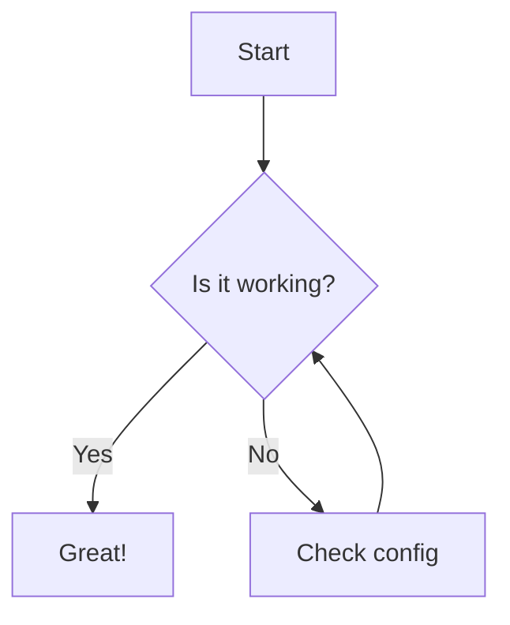

# Available Features

This template includes several built-in features to enhance your documentation.

## Hints (Custom Containers)

Hints are useful for highlighting specific information. You can use `info`, `tip`, `warning`, `danger`, and `details`.

::: info
This is an **info** box. Use it for general information.
:::

::: tip
This is a **tip**. Use it for helpful suggestions.
:::

::: warning
This is a **warning**. Use it to highlight potential issues.
:::

::: danger
This is a **danger** box. Use it for critical warnings.
:::

::: details Click to expand
This is a **details** box. It's collapsed by default and can be used to hide long content.
:::

---

## Tabs

Tabs are great for showing alternative code snippets or related content in a compact way.

::: tabs

@tab HTML
```html
<div class="hello">Hello World</div>
```

@tab CSS
```css
.hello { color: blue; }
```

@tab JS
```javascript
console.log('Hello World');
```

:::

---

## Mermaid Diagrams

You can embed Mermaid diagrams directly in your markdown using code blocks.



---

## Search

This template includes a powerful search engine (**Slimsearch**) that helps you find content across all your material.

- **Location**: Use the search bar in the top-right corner.
- **Shortcuts**: Press `s` or `Ctrl + S` to focus the search input.
- **Features**: Supports full-text search, keyboard navigation, and instantly indexing your files.

---

## Media & Embeds

The template includes several components for enriching your content with interactive elements and media.

### Video
Embed YouTube videos easily with optional start and end times.

| Prop | Type | Default | Description |
| --- | --- | --- | --- |
| `id` | String | (none) | The YouTube video ID |
| `start` | Number | 0 | Start time in seconds |
| `host` | String | `youtube` | Video hosting provider |

```html
<Video id="09oErCBjVns" start="10" />
```

<Video id="09oErCBjVns" start="10" />

---

### Interactive Sandboxes

Use these components to embed live code editors for exercises and demonstrations.

#### CodePen (Pens)

Use the custom `<Pen>` component to embed interactive CodePen snippets. This is especially useful for front-end exercises.

<Pen title="Simple Button Demo" :height="300" bootstrap>
  <template #html>
    &lt;button class="btn btn-primary"&gt;Click Me&lt;/button&gt;
  </template>
  <template #style>
    .btn { margin: 20px; }
  </template>
  <template #script>
    document.querySelector('.btn').addEventListener('click', () => {
      alert('Hello from CodePen!');
    });
  </template>
</Pen>

> [!TIP]
> You can pass props like `bootstrap`, `jquery`, or `scss` to the `<Pen>` component to automatically load dependencies.

---


#### StackBlitz
Best for modern frontend frameworks and Node.js environments.

```html
<Stackblitz id="react-myu3ovev" height="400" />
```

<Stackblitz id="react-myu3ovev" height="400" />

---

### Utilities

#### Can I Use
Embed real-time browser support tables from [caniuse.com](https://caniuse.com).

```html
<Caniuse feat="flexbox" interactive />
```

<Caniuse feat="flexbox" interactive />


