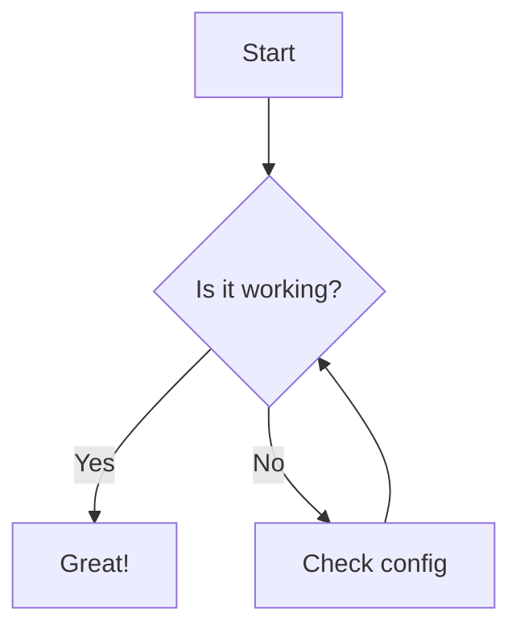

# Available Features

This template includes several built-in features to enhance your documentation.

## Hints (Custom Containers)

Hints are useful for highlighting specific information. You can use `info`, `tip`, `warning`, `danger`, and `details`.

::: info
This is an **info** box. Use it for general information.
:::

::: tip
This is a **tip**. Use it for helpful suggestions.
:::

::: warning
This is a **warning**. Use it to highlight potential issues.
:::

::: danger
This is a **danger** box. Use it for critical warnings.
:::

::: details Click to expand
This is a **details** box. It's collapsed by default and can be used to hide long content.
:::

---

## Tabs

Tabs are great for showing alternative code snippets or related content in a compact way.

::: tabs

@tab HTML
```html
<div class="hello">Hello World</div>
```

@tab CSS
```css
.hello { color: blue; }
```

@tab JS
```javascript
console.log('Hello World');
```

:::

---

## Mermaid Diagrams

You can embed Mermaid diagrams directly in your markdown using code blocks.


```mermaid
graph TD
    A[Start] --> B{Is it working?}
    B -- Yes --> C[Great!]
    B -- No --> D[Check config]
    D --> B
```

---

## Search

This template includes a powerful search engine (**Slimsearch**) that helps you find content across all your material.

- **Location**: Use the search bar in the top-right corner.
- **Shortcuts**: Press `s` or `Ctrl + S` to focus the search input.
- **Features**: Supports full-text search, keyboard navigation, and instantly indexing your files.

---

## Media & Embeds

The template includes several components for enriching your content with interactive elements and media.

### Video
Embed YouTube videos easily with optional start and end times.

| Prop | Type | Default | Description |
| --- | --- | --- | --- |
| `id` | String | (none) | The YouTube video ID |
| `start` | Number | 0 | Start time in seconds |
| `host` | String | `youtube` | Video hosting provider |

```html
<Video id="09oErCBjVns" start="10" />
```

<Video id="09oErCBjVns" start="10" />

---

### Interactive Sandboxes

Use these components to embed live code editors for exercises and demonstrations.

#### CodePen (Pens)

Use the custom `<Pen>` component to embed interactive CodePen snippets. This is especially useful for front-end exercises.

<Pen title="Simple Button Demo" :height="300" bootstrap>
  <template #html>
    &lt;button class="btn btn-primary"&gt;Click Me&lt;/button&gt;
  </template>
  <template #style>
    .btn { margin: 20px; }
  </template>
  <template #script>
    document.querySelector('.btn').addEventListener('click', () => {
      alert('Hello from CodePen!');
    });
  </template>
</Pen>

> [!TIP]
> You can pass props like `bootstrap`, `jquery`, or `scss` to the `<Pen>` component to automatically load dependencies.

---


#### StackBlitz
Best for modern frontend frameworks and Node.js environments.

```html
<Stackblitz id="react-myu3ovev" height="400" />
```

<Stackblitz id="react-myu3ovev" height="400" />

---

### Utilities

#### Can I Use
Embed real-time browser support tables from [caniuse.com](https://caniuse.com).

```html
<Caniuse feat="flexbox" interactive />
```

<Caniuse feat="flexbox" interactive />

---

## AI Chatbot (`GeminiCourseChat`)

This template includes an interactive AI assistant component (`<GeminiCourseChat />`) powered by Google Gemini to help students ask questions directly about the course material.

### Key Features
- **Context-Aware Assistance**: Answers questions using the automatically generated course documentation context (`llms-full.txt`).
- **Student API Key Setup**: Guided modal onboarding for students to supply their own free Google Gemini API key, securely stored in local browser storage (`localStorage`).
- **Model Selection & Failover**: Toggle between different Gemini models (e.g. Gemini 3.6 Flash, 3.5 Flash Lite) with built-in rate-limit monitoring and automatic failover handling.
- **Persistent Local History**: Automatically saves question history locally for easy reference and management.

### Basic Usage

Embed the chatbot into any Markdown page:

```html
<GeminiCourseChat />
```

### Component Props

| Prop | Type | Default | Description |
| --- | --- | --- | --- |
| `botName` | String | `'CourseBot'` | Custom display name for the chatbot assistant. |
| `model` | String | `'gemini-3.6-flash'` | Default Gemini model identifier to start with. |
| `systemPrompt` | String | `''` | Custom system instructions to override the default prompt behavior. |

---

## Interactive IT Course Components

These custom components are designed specifically for Computer Science & IT documentation to increase student engagement, self-assessment, and visual clarity.

### Interactive Quiz (`<Quiz />`)

Multiple-choice knowledge check with instant feedback and explanations.

```html
<Quiz 
  question="Which HTTP method should be used to partially update a resource?"
  :options="['GET', 'POST', 'PUT', 'PATCH']"
  :correct-index="3"
  explanation="PATCH is used for partial updates, whereas PUT replaces the entire resource."
/>
```

<Quiz 
  question="Which HTTP method should be used to partially update a resource?"
  :options="['GET', 'POST', 'PUT', 'PATCH']"
  :correct-index="3"
  explanation="PATCH is used for partial updates, whereas PUT replaces the entire resource."
/>

---

### Flashcard (`<Flashcard />`)

3D flip card for quick recall of technical terms, acronyms, CLI flags, or status codes.

```html
<Flashcard category="HTTP Status Codes" term="HTTP 403 Forbidden">
  <template #back>
    The server understands the request but refuses to authorize it. Unlike 401 Unauthorized, re-authenticating will not make a difference.
  </template>
</Flashcard>
```

<Flashcard category="HTTP Status Codes" term="HTTP 403 Forbidden">
  <template #back>
    The server understands the request but refuses to authorize it. Unlike 401 Unauthorized, re-authenticating will not make a difference.
  </template>
</Flashcard>

---

### Download Card (`<DownloadCard />`)

Visual card component for downloadable course assets (starter zips, cheatsheet PDFs, database dumps).

```html
<DownloadCard 
  title="Lab 01 Starter Project"
  description="Download the initial HTML/CSS boilerplate files for Lab 01."
  filename="lab01-starter.zip"
  fileSize="1.2 MB"
  url="/files/lab01-starter.zip"
/>
```

<DownloadCard 
  title="Logo"
  description="Download the course logo."
  filename="logo.png"
  url="/logo.png"
/>

---

### Technical KeyTerm Tooltip (`<KeyTerm />`)

Displays an inline technical glossary tooltip when students hover or tap on terms or acronyms.

```html
Always verify your <KeyTerm term="CORS" definition="Cross-Origin Resource Sharing is a HTTP-header based security mechanism.">CORS</KeyTerm> configuration before deployment.
```

Always verify your <KeyTerm term="CORS" definition="Cross-Origin Resource Sharing is an HTTP-header based security mechanism allowing servers to specify permitted origins.">CORS</KeyTerm> configuration before deployment.

---

### Interactive Lab Stepper (`<StepByStep />`)

Wizard stepper component for step-by-step lab tutorials or algorithm walkthroughs.

```html
<StepByStep title="Lab Setup Guide" :steps="['Install Node', 'Initialize', 'Start Dev Server']">
  <template #step-1>
    <p>Download Node.js LTS from official website.</p>
  </template>
  <template #step-2>
    <p>Run <code>npm init -y</code> in your workspace.</p>
  </template>
  <template #step-3>
    <p>Run <code>npm run dev</code> to verify server startup.</p>
  </template>
</StepByStep>
```

<StepByStep title="Lab Setup Guide" :steps="['Install Node', 'Initialize', 'Start Dev Server']">
  <template #step-1>
    <p>Download Node.js LTS from official website.</p>
  </template>
  <template #step-2>
    <p>Run <code>npm init -y</code> in your workspace.</p>
  </template>
  <template #step-3>
    <p>Run <code>npm run dev</code> to verify server startup.</p>
  </template>
</StepByStep>


